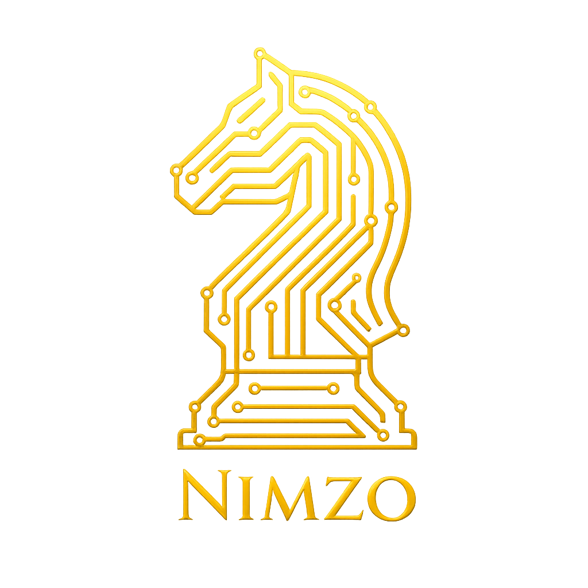
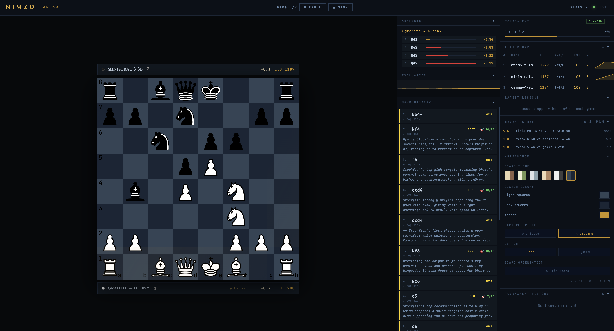

<p align="center">
  
</p>

<h1 align="center">Nimzo</h1>

<p align="center">
  AI chess tournament system where locally-hosted LLMs compete against each other.
</p>

---

Uses **guided mode**: Stockfish generates ranked candidate moves and each model picks one with reasoning — so matches test strategic judgment, not move generation.

Models learn from their games. After each match both players receive lessons generated from their mistakes and strengths; those lessons are injected into their system prompt for every subsequent game.



---

## Quick start

```bash
# 1. Install dependencies
pip install -r requirements.txt

# 2. Install Stockfish
brew install stockfish          # macOS
sudo apt install stockfish      # Debian/Ubuntu

# 3. (Optional) add API key for lesson generation
echo "ANTHROPIC_API_KEY=sk-..." >> .env

# 4. Start
python -m arena
# Browser opens automatically at http://localhost:8765
```

Select your models in the browser, hit **Start**, and watch.

---

## How it works

Each turn:
1. Stockfish analyses the position and produces the top N candidate moves with centipawn scores
2. The model receives the board (FEN), game history (PGN), candidate list, and lessons from previous games
3. Model responds with a choice, the UCI move, and reasoning
4. Move quality is labelled (`best` `excellent` `good` `inaccuracy` `mistake` `blunder`) by comparing the chosen move's score against Stockfish's top pick

---

## Viewer features

The browser UI at `http://localhost:8765` includes:

- **Live board** with move highlighting and board-flip toggle
- **Candidate moves panel** — Stockfish's ranked options with centipawn scores
- **Reasoning display** — each model's explanation per move
- **Live centipawn eval graph** — fills white/black advantage areas in real time
- **ELO leaderboard** with per-player sparklines
- **Move history** with quality glyphs (`!!` / `!` / `?!` / `?` / `??`)
- **Game replay** — click any recent game to step through it move by move
- **Annotated PGN export** — one-click download with reasoning as `{ }` comments and quality glyphs; opens directly in Lichess
- **Lessons panel** — post-game coaching notes per model
- **Tournament controls** — configure models, start / pause / resume / stop from the UI

Stats page at `http://localhost:8765/stats`:
- ELO trajectory chart per model
- Move quality breakdown (stacked bar per model)
- Win rate by colour
- Head-to-head records

---

## Model setup

Both players default to `http://localhost:1234/v1` — the standard LM Studio address. Load whichever models you want in LM Studio, then pick them by ID in the browser UI. No `.env` model config needed.

If you need two large models that can't coexist in one LM Studio instance, start a second instance on port 1235 and point the Black player's URL there.

Ollama and any other OpenAI-compatible endpoint also work — just paste the base URL into the URL field in the UI.

---

## CLI mode

GUI mode is the recommended path. CLI mode is available for headless / scripted runs:

```bash
python -m arena \
  --white-name "Qwen3-30B" --white-model qwen3-30b-a3b \
  --black-name "Gemma-3-4B" --black-model google/gemma-3-4b \
  --games 5 --no-browser
```

Model IDs must be passed as flags — `.env` variables do **not** trigger CLI mode.

### All flags

| Flag | Default | Description |
|---|---|---|
| `--white-name` | — | Display name for White |
| `--white-model` | — | Model ID for White |
| `--black-name` | — | Display name for Black |
| `--black-model` | — | Model ID for Black |
| `--games N` | `1` | Number of games to play |
| `--white-url` | `http://localhost:1234/v1` | LM Studio / Ollama endpoint for White |
| `--black-url` | `http://localhost:1234/v1` | LM Studio / Ollama endpoint for Black |
| `--thinking` | off | Enable extended thinking (Qwen3-style models) |
| `--no-browser` | off | Don't open the browser automatically |
| `--port` | `8765` | Port for the web server |

---

## ELO & learning

ELO is stored in `nimzo.db` (SQLite) and keyed by model ID — renaming a model in the UI won't reset its score. K-factor decays with experience (32 → 24 → 16) for stability as a model accumulates games.

Lesson generation requires `ANTHROPIC_API_KEY`. Without it, games run and ELO is tracked — lessons are silently skipped. A local Ollama model can be used as the tutor instead; configure it in the Tutor section of the UI.

---

## Environment variables

Only infrastructure settings belong in `.env` — model selection happens in the UI.

| Variable | Default | Description |
|---|---|---|
| `STOCKFISH_PATH` | `/usr/games/stockfish` | Path to the Stockfish binary |
| `ANTHROPIC_API_KEY` | — | Required for Anthropic lesson generation |
| `GOOGLE_API_KEY` | — | Google AI Studio key for model portrait generation (optional; portraits are skipped if absent) |

---

## Architecture

```
arena/            — FastAPI server package
  state.py          — shared mutable state, broadcast(), TournamentAborted
  models.py         — Pydantic models (PlayerSpec, TournamentStartConfig)
  app.py            — FastAPI app, lifespan, startup utilities
  cli.py            — argparse entry point (python -m arena)
  routes/           — API route modules (games, models, stats, tournament)
game.py           — core game loop (play_game), tournament runners, build_player
engine.py         — Stockfish wrapper: candidate generation, move quality evaluation
analysis.py       — ELO calculation, lesson generation, opening detection
db.py             — SQLite persistence: players, games, moves, ELO history, lessons
openings.json     — 3,700-entry ECO lookup table for opening detection in lessons
models/
  base.py         — abstract ChessPlayer, prompt builder, lesson memory
  lmstudio_player.py  — OpenAI-compatible client (LM Studio, Ollama, etc.)
  anthropic_player.py — Anthropic API client
viewer.html       — main SPA served at http://localhost:8765
stats.html        — stats page served at http://localhost:8765/stats
```

### WebSocket events

The arena broadcasts JSON events to `ws://localhost:8765/ws`.

| Event | Key fields |
|---|---|
| `game_start` | `white`, `black`, `white_elo`, `black_elo`, `fen` |
| `thinking` | `player`, `color`, `fen`, `candidates[]` |
| `move` | `san`, `uci`, `quality`, `candidate_rank`, `reasoning`, `fen`, `score_cp` |
| `game_over` | `result`, `termination`, `white_elo_after`, `black_elo_after`, `game_id` |
| `tournament_status` | `status`, `game_number`, `total_games` |

### REST endpoints

| Method | Path | Description |
|---|---|---|
| `GET` | `/api/status` | Current tournament state |
| `GET` | `/api/leaderboard` | All players sorted by ELO |
| `GET` | `/api/games` | Recent games |
| `GET` | `/api/games/{id}/moves` | Move list for a game |
| `GET` | `/api/games/{id}/pgn` | Annotated PGN download |
| `GET` | `/api/elo-history/{model_id}` | ELO over time |
| `GET` | `/api/models` | Available models from an LM Studio endpoint |
| `POST` | `/api/start` | Start a tournament |
| `POST` | `/api/pause` | Pause between games |
| `POST` | `/api/resume` | Resume a paused tournament |
| `POST` | `/api/stop` | Stop after current game |

---

## Adding a backend

Subclass `ChessPlayer` in `models/base.py`:

```python
class MyPlayer(ChessPlayer):
    def choose_move(self, board, candidates, game_history_pgn) -> MoveDecision:
        prompt = self.build_prompt(board, candidates, game_history_pgn)
        # call your backend, parse response
        return MoveDecision(uci, reasoning, candidate_rank, raw)
```

Then add a branch in `build_player()` in `game.py`.
